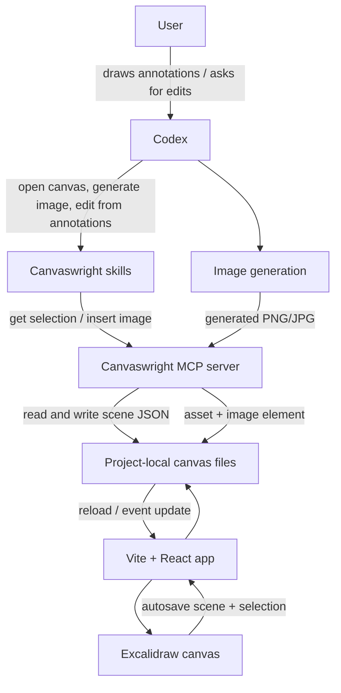

# Canvaswright

Canvaswright is a local Excalidraw canvas for Codex-assisted image generation, annotation, and visual iteration.

It gives Codex a project-local drawing surface: you can place generated images on the canvas, mark the exact areas you want changed, and ask Codex to create a clean revised image from those annotations.


## What It Does

- Opens an Excalidraw canvas inside a local Vite app.
- Saves the canvas scene and selected elements in the active project.
- Lets Codex inspect selected Excalidraw elements through MCP.
- Lets Codex insert generated bitmap images back into the canvas.
- Supports annotation-driven workflows, such as "make this title more artistic" or "change these two badges to different colors."

## Quick Start

```bash
npm install
npm run dev
```

Open:

```text
http://127.0.0.1:43218/
```

To run Canvaswright for another project directory:

```bash
./scripts/start-canvas.sh /path/to/project
```

The canvas data is stored in that project:

```text
canvas/pages/main/excalidraw-scene.json
canvas/pages/main/assets/
canvas/selection.json
```

`canvas/` is runtime data and is ignored by git by default.

## Example Workflow

The example below starts with an ecommerce poster, then uses canvas annotations to request targeted edits.

| Original poster | Revised from annotations |
| --- | --- |
|  |  |

User annotations in the canvas:

- Circle the title and write: `标题要有艺术感`
- Circle the two feature badges and write: `这两个换个颜色展示`
- Ask Codex: `请根据我的标注修改`

Codex then reads the canvas scene, interprets the annotations, generates a clean revised poster, and inserts the result next to the original for comparison.

## How Codex Uses Canvaswright



In practice, the next Codex call uses these primitives:

- Skill: `canvaswright-open-canvas` opens the local canvas for the active project.
- Skill: `canvaswright-image-gen` generates or places a new image into the canvas.
- Skill: `canvaswright-image-edit` reads annotation intent and creates a clean revised image.
- MCP tool: `get_canvaswright_selection` reads selected Excalidraw elements.
- MCP tool: `insert_canvaswright_image` copies a local image into `canvas/pages/main/assets/` and adds an Excalidraw image element.

## Project Structure

```text
.
├── .codex-plugin/
│   └── plugin.json              # Codex plugin manifest
├── .mcp.json                    # MCP server registration
├── mcp/
│   ├── server.mjs               # MCP tool server
│   └── canvas-actions.mjs       # Selection and image insertion actions
├── scripts/
│   └── start-canvas.sh          # Start the canvas for a target project
├── skills/
│   ├── canvaswright-open-canvas/
│   ├── canvaswright-image-gen/
│   └── canvaswright-image-edit/
├── src/
│   ├── App.jsx                  # Excalidraw UI shell
│   ├── lib/                     # Scene normalization and insertion planning
│   └── server/                  # Vite middleware and canvas storage
├── docs/images/                 # README images
├── index.html
├── package.json
└── vite.config.js
```

Runtime project data:

```text
canvas/
├── selection.json
└── pages/main/
    ├── excalidraw-scene.json
    └── assets/
```

## Tech Stack

Current locked development environment:

| Layer | Version |
| --- | --- |
| Node.js | 20.19.6 |
| npm | 10.8.2 |
| React | 18.3.1 |
| React DOM | 18.3.1 |
| Vite | 8.0.16 |
| @vitejs/plugin-react | 5.2.0 |
| @excalidraw/excalidraw | 0.18.1 |

Package ranges are kept in `package.json`; exact installed versions are locked by `package-lock.json`.

## Development

```bash
npm install
npm test
npm run build
```

Plugin validation:

```bash
python3 ~/.codex/skills/.system/plugin-creator/scripts/validate_plugin.py .
```

Useful local checks:

```bash
npm test
npm run build
curl -fsS http://127.0.0.1:43218/api/health
```

## Notes

- Canvaswright is designed for local project workflows. The app stores scenes and generated assets beside the project you are working on.
- The MCP server edits local canvas files; image generation is performed by Codex's available image generation capability and then inserted into the canvas.
- Keep generated runtime canvas data out of commits unless you intentionally want to publish a demo scene.
