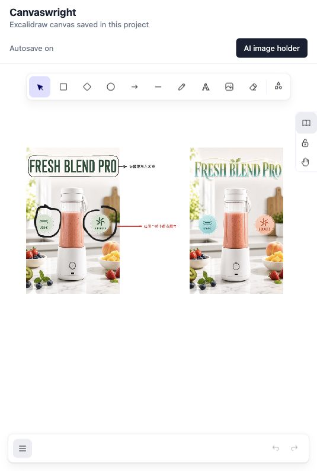
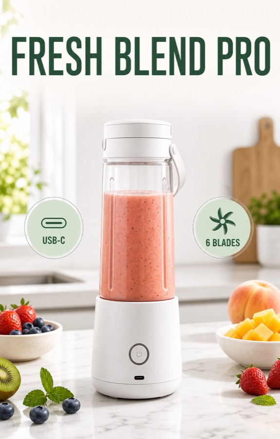
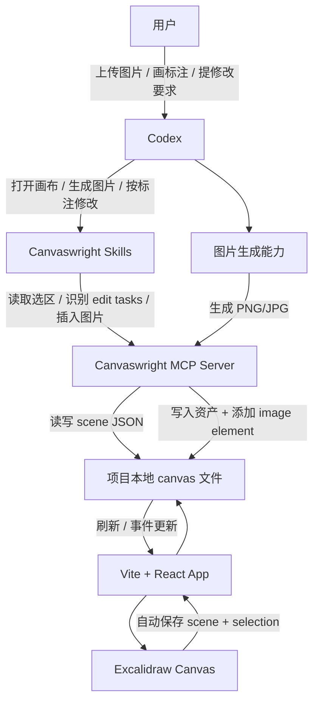

# Canvaswright

Canvaswright 是一个面向 Codex 的本地 Excalidraw 画布工具，用来完成“生成图片 - 在画布标注 - 按标注局部修改 - 回插结果”的视觉创作流程。

它不是单纯的画板，而是给 Codex 提供一个可读写的项目级画布：你可以把一张或多张图片放到画布上，直接圈选、画箭头、写修改说明，然后让 Codex 根据标注生成干净的修改版。

致谢：[zhongerxin/cowart](https://github.com/zhongerxin/cowart) 为本项目提供了重要思路。



## 能做什么

- 在本地 Vite 应用中打开 Excalidraw 画布。
- 将画布 scene、选区和素材保存到当前项目目录。
- 让 Codex 通过 MCP 读取当前选区和画布标注。
- 自动把多张图上的标注归属到对应目标图，避免误改。
- 让 Codex 把生成后的 PNG/JPG 回插到原图旁边。
- 支持“标题更有艺术感”“这两个区域换个颜色”“按我的标注修改”等视觉迭代场景。

## 快速开始

```bash
npm install
npm run dev
```

打开：

```text
http://127.0.0.1:43218/
```

如果要给另一个项目目录启动画布：

```bash
./scripts/start-canvas.sh /path/to/project
```

画布运行数据会保存在目标项目里：

```text
canvas/pages/main/excalidraw-scene.json
canvas/pages/main/assets/
canvas/selection.json
```

`canvas/` 是运行时数据，默认被 `.gitignore` 忽略。

## 使用示例

下面这个示例从一张电商海报开始，在画布上标注后，让 Codex 生成修改版。

| 原始海报 | 按标注修改后的海报 |
| --- | --- |
|  |  |

画布标注内容：

- 圈住标题，写：`标题要有艺术感`
- 圈住两个功能徽章，写：`这两个换个颜色展示`
- 对 Codex 说：`请根据我的标注修改`

Codex 会读取画布 scene，识别标注意图，生成一张去掉标注痕迹的干净修改图，并插入到原图旁边方便对比。

## 多图标注怎么判断

当画布里有多张图片时，Canvaswright 会把标注解析成明确的 edit tasks。

判断规则：

- 如果你选中了某张图，这张图优先作为修改目标。
- 如果没有选中图，标注会优先归属给它覆盖到的图片。
- 如果标注没有覆盖图片，会归属给距离最近的图片。
- 如果文字说明靠近一条线、箭头或圈选标注，文字会跟随那条标注归属到同一张图。
- 如果一个标注明显同时覆盖多张图，Canvaswright 会标记为 ambiguous，不会强行猜。

推荐操作：

1. 把一张或多张图片放到画布。
2. 在要修改的图上画圈、箭头、线条，并写说明文字。
3. 如果担心歧义，先选中目标图。
4. 对 Codex 说：`请根据我的标注修改`。

Codex 会先调用 `get_canvaswright_edit_tasks`，拿到结构化任务，再逐个生成修改版。回插图片时会传入目标图 id：

```json
{
  "imagePath": "/path/to/revised.png",
  "anchorElementId": "source-image-element-id",
  "placement": "right"
}
```

这样即使同一画布上有多张图，结果也会插入到对应原图旁边。

## Codex 调用结构



Codex 下次调用时主要用这些能力：

- Skill: `canvaswright-open-canvas` 打开当前项目的本地画布。
- Skill: `canvaswright-image-gen` 生成图片并放到选中 holder 或指定元素旁边。
- Skill: `canvaswright-image-edit` 根据画布标注生成干净修改版。
- MCP tool: `get_canvaswright_selection` 读取当前 Excalidraw 选区。
- MCP tool: `get_canvaswright_edit_tasks` 将标注归属到目标图片，适合多图修改。
- MCP tool: `insert_canvaswright_image` 将本地图片复制到 `canvas/pages/main/assets/`，并添加到 Excalidraw scene。传 `anchorElementId` 可以明确插到某张源图旁边。

## 项目结构

```text
.
├── .codex-plugin/
│   └── plugin.json              # Codex 插件清单
├── .mcp.json                    # MCP server 注册
├── mcp/
│   ├── server.mjs               # MCP 工具服务
│   └── canvas-actions.mjs       # 选区、edit task、图片插入动作
├── scripts/
│   └── start-canvas.sh          # 为指定项目启动画布
├── skills/
│   ├── canvaswright-open-canvas/
│   ├── canvaswright-image-gen/
│   └── canvaswright-image-edit/
├── src/
│   ├── App.jsx                  # Excalidraw UI 外壳
│   ├── lib/                     # scene 归一化、edit task、插入规划
│   └── server/                  # Vite middleware 和画布存储
├── docs/images/                 # README 配图
├── index.html
├── package.json
└── vite.config.js
```

运行时数据结构：

```text
canvas/
├── selection.json
└── pages/main/
    ├── excalidraw-scene.json
    └── assets/
```

## 技术栈版本

当前锁定的开发环境：

| 层 | 版本 |
| --- | --- |
| Node.js | 20.19.6 |
| npm | 10.8.2 |
| React | 18.3.1 |
| React DOM | 18.3.1 |
| Vite | 8.0.16 |
| @vitejs/plugin-react | 5.2.0 |
| @excalidraw/excalidraw | 0.18.1 |

`package.json` 保留依赖范围，精确安装版本由 `package-lock.json` 锁定。

## 开发与验证

```bash
npm install
npm test
npm run build
```

插件校验：

```bash
python3 ~/.codex/skills/.system/plugin-creator/scripts/validate_plugin.py .
```

常用本地检查：

```bash
npm test
npm run build
curl -fsS http://127.0.0.1:43218/api/health
```

## 注意事项

- Canvaswright 面向本地项目工作流，画布数据和素材会保存到当前项目下。
- MCP server 只读写本地 canvas 文件；图片生成由 Codex 当前可用的图片生成能力完成。
- 不要默认提交 `canvas/` 运行时数据，除非你明确想发布一个 demo scene。

---

## English Version

Canvaswright is a local Excalidraw canvas for Codex-assisted image generation, annotation, and visual iteration.

It gives Codex a project-local drawing surface: place one or more images on the canvas, mark exact areas with circles, arrows, and text notes, then ask Codex to generate clean revised images from those annotations.

Acknowledgements: [zhongerxin/cowart](https://github.com/zhongerxin/cowart) provided important inspiration for this project.

### Quick Start

```bash
npm install
npm run dev
```

Open:

```text
http://127.0.0.1:43218/
```

To run Canvaswright for another project directory:

```bash
./scripts/start-canvas.sh /path/to/project
```

### Multi-image Editing

Canvaswright analyzes a canvas with multiple images and turns annotations into explicit edit tasks.

Rules:

- A selected image takes priority as the edit target.
- Without selection, annotations are assigned by overlap first, then proximity.
- Text notes follow nearby line, arrow, or shape annotations when possible.
- An annotation that clearly touches multiple images is marked ambiguous instead of being guessed.

Codex uses `get_canvaswright_edit_tasks` to get structured tasks, generates revised images, and inserts each result beside its source image with `insert_canvaswright_image` and `anchorElementId`.

### Development

```bash
npm install
npm test
npm run build
```

Plugin validation:

```bash
python3 ~/.codex/skills/.system/plugin-creator/scripts/validate_plugin.py .
```
